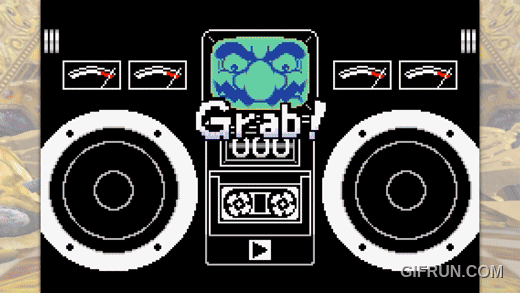
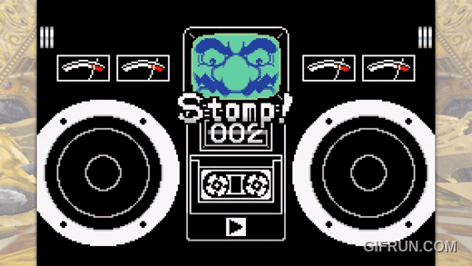
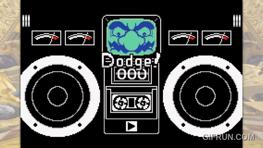
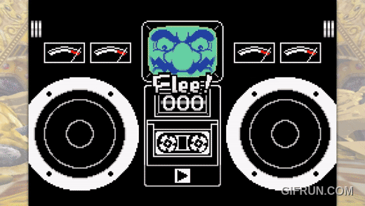

# WarioWare: Task vs Survival

A senior research project that trains a Deep Q-Network (DQN) on two sets of microgames in _WarioWare, Inc.: Mega Microgame$!_ for Game Boy Advance.
 
## Task microgames

Complete an objective before time runs out.

- Mug Shot
- Super Wario Bros

## Survival microgames

Remain "alive" and pay attention to complete an objective.

- Crazy Cars
- Dodge Balls

***

# Setup

Step 1: Install [stable-retro](https://stable-retro.farama.org/), a framework that creates gymnasium environments for use in reinforcement learning. Note that Python versions 3.7 to 3.12 are supported.

Step 2: Obtain a ROM of the game and import it using the Integration UI.

Step 3: Clone this repository to obtain state files, which set the agent to begin training right as the microgame begins.

Step 4: Execute "run_dqn.py" to train the DQN on the microgame "Crazy Cars". Change 'microgame_name' and the environment wrapper to match whichever microgame you wish to train.
**Default training takes about 1.5-2 hrs on GPU. Expect it to take longer if you also wish to render.**

***

## Support
Any questions or issues? Message miguelaaguilera01@gmail.com.

## Authors and acknowledgment
I would like to acknowledge and thank Dr. Charles Girard, who served as my mentor for this research project. 

## License
TBA

## Project status
Complete. Integrating JSON data files to convert the DQN from CnnPolicy to MlpPolicy may be attempted in the future.
